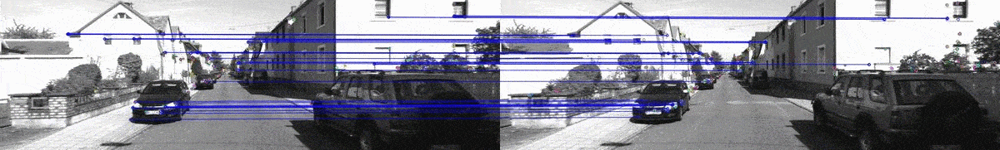
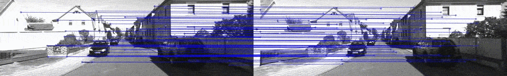
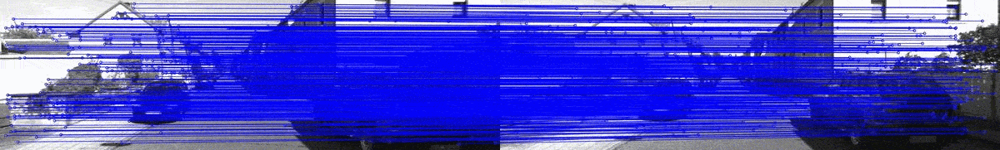

## FeatureTracker

### What this repository for
Detect, match and track different type features

**Current type of feture points**
  - [X] ORB feature points
  - [X] SuperPoint feature points

### Usage
**PreInstall**

install libpytorch: [Install from source with Anaconda](https://pytorch.org/get-started/locally/)
Set libpytorch cmake path at CMakeLists.txt

**Dependence Info**

pytorch: 1.1.0

cuda/cudatoolkit: 9.0

**Build**
```bash
$ cd FeatureTracker
$ mkdir build
$ cd build && cmake ..
$ make -j4
```

**Run**
***ORB feature points***
```bash
$ ./FeatureTracker --image_dir /path/to/images_dir --type orb [--image_suffix .jpg]
```
***SuperPoint feature points***
```bash
Download superpoint model
$ cd utils
$ wget https://github.com/MagicLeapResearch/SuperPointPretrainedNetwork/raw/master/superpoint_v1.pth
$ python pytorch_model_convert.py superpoint_v1.pth
$ cd ../build
$ ./FeatureTracker --image_dir /path/to/image_dir --model_path ../utils/super_point_scripted_model.pt --type sp [--image_suffix .jpg --H 480 --W 640]
```

Kitti:

**ORB Tracker**




**SuperPoint Tracker**

Resized image to 414, 125 (width/3, height/3)


Original size image

